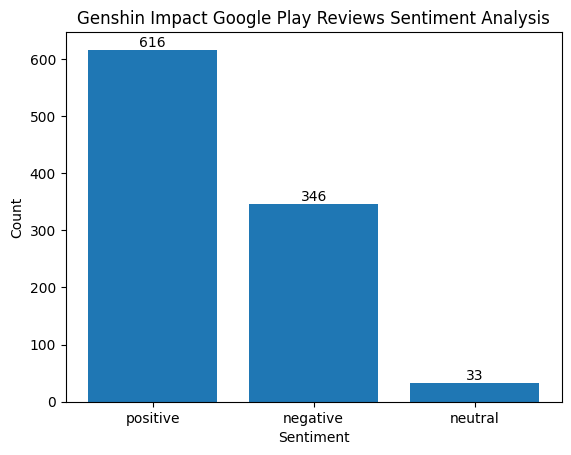

# Genshin Impact Google Play Reviews Sentiment Analysis

## Notebook Link

[Click here to open the Jupyter notebook in Google Colab](https://colab.research.google.com/drive/1-Xhj2Q6Jp0xy0A5ud4Ls3t9qh3wLfuAG?usp=sharinghttps://www.kaggle.com/datasets/supriyoain/genshin-impact-google-play-review)

Secrets needed:

-   KAGGLE_KEY and KAGGLE_USERNAME, which can be obtained by logging into Kaggle and [creating a new token](https://www.kaggle.com/settings).
-   REPLICATE_API_TOKEN, which can be obtained by logging into Replicate and [copying the API token](https://replicate.com/account/api-tokens). Replicate API credit billing is required.

## Dataset

Source: [Genshin Impact Google Play Reviews on Kaggle](https://www.kaggle.com/datasets/supriyoain/genshin-impact-google-play-reviews)

## Overview & Analysis Process

This project analyzes user reviews of Genshin Impact from Google Play to understand player sentiment and identify areas for improvement. The process includes:

-   Downloading and loading the dataset
-   Classifying review sentiment (positive, negative, neutral) using IBM Granite
-   Visualizing sentiment distribution with bar charts
-   Summarizing user feedback in bullet points and paragraphs
-   Recommending actionable improvements for developers

## Insight & Findings

Key findings from the analysis process:

-   Out of 995 reviews, 616 are labeled as positive, 346 as negative, and the remaining 33 as neutral. The result is presented in the graph below.

    
-   Positive reviews highlight high-quality visuals, engaging storylines and lore, character design, open-world exploration, combat mechanics, gameplay immersion, and more.
-   Negative reviews highlight the "pay-to-win" gacha mechanism, repetitive grinding, unskippable cutscenes, high storage demand, performance issues on low-end devices, poor customer service, and more.

## Summary & Recommendations

**Key Positives:**

-   Stunning graphics and visuals
-   Engaging storyline and lore
-   Beautiful character designs
-   Open-world exploration and strategic combat
-   Regular updates and an active community

**Key Negatives:**

-   Gacha system perceived as pay-to-win
-   Repetitive quests and grinding
-   High storage requirements
-   Performance issues on lower-end devices
-   Limited controller support and customer service concerns

**Recommendations for Developers:**

-   Optimize storage requirements
-   Improve rewards and gacha fairness for free-to-play players
-   Add more endgame content and streamline progression
-   Enhance customer support and technical stability
-   Expand controller support and community features

## AI Support Explanation

This is a capstone project for [this online course by IBM and Hacktiv8](https://hacktiv8.com/projects/ibm) about implementing IBM Granite generative AI for data science purposes. This analysis leverages AI models ([IBM Granite 3.3-8b-instruct](https://replicate.com/ibm-granite/granite-3.3-8b-instruct)) to automate sentiment classification and generate summaries and recommendations. The AI processes each review, classifies sentiment, and synthesizes user feedback to provide actionable insights for game improvement.
